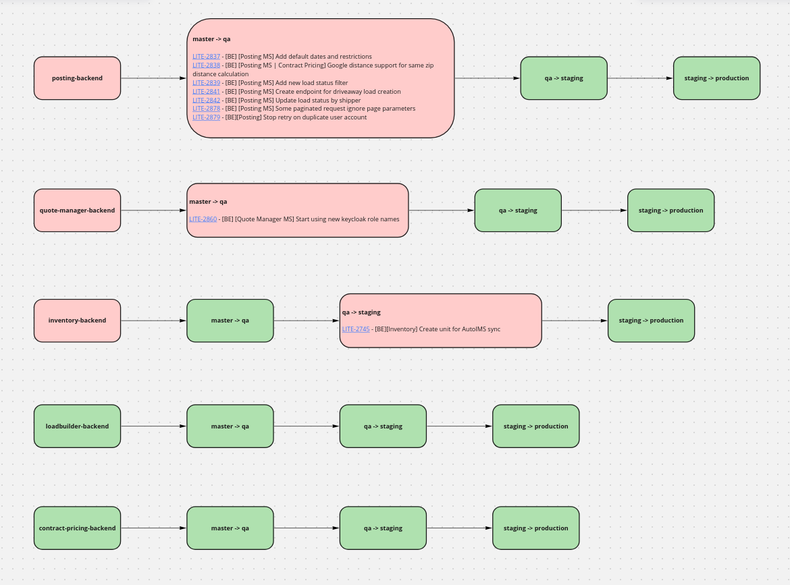

# Git Apollo Miraisor

Visualize your Git branches and Jira ticket statuses on a Miro board with GitApolloMiraisor.

This tool seamlessly integrates your Git repositories with Jira issues,
generating a comprehensive visual overview of your development progress.
Easily track differences between branches and navigate to Jira tickets directly
from the Miro board, streamlining your project management and collaboration efforts.
Embrace the wisdom of Apollo and unlock the potential of your software development 
process with GitApolloMiraisor.
